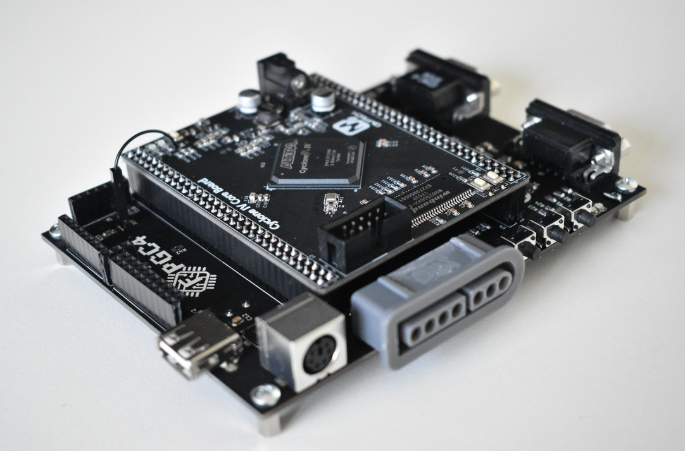

# Welcome to the FPGC4 Wiki!

[](https://www.github.com/b4rt-dev/FPGC4)

On this page, you will find a brief introduction of this project. For (many) more details, use the navigation in the left menu.

## What it is
The FPGC4 (Field Programmable Game Console v4) is an open source project, built around a completely self designed SoC (System on a Chip), implemented on an FPGA.

Originally, the goal of this project, which started in 2017, was to design a simple game console for an FPGA (hence the name FPGC). Eventually this idea shifted more towards creating an entire PC with the capabilities of a game console. 

To keep the complexity of the project low, most features of the FPGC4 are very retro, like tile and sprite based rendering, RGBs video signals for CRT TVs (using RGB SCART), PS/2 Keyboard and SNES controller support. However, some more modern features were also added, like a 32 bit CPU, 32MiB SDRAM and USB host support (though a CH376T controller).

The main components of the FPGC4 are a self designed 32 bit CPU, a self designed GPU (tile/sprite based), and a self designed memory unit.

Aside from the hardware, this project also contains smaller software projects like an assembler, software libraries, programmer, MIDI converter and example code.

## What it can do
Basically, the FPGC4 can run code, output video (with some basic audio), and can interact with certain peripherals using GPIO, SPI or UART. It also has a USB host port for mass storage, a PS/2 port for a keyboard and a SNES controller port for a SNES controller. It has 32MiB SDRAM and the program code is loaded from an SPI flash module. The board is powered from a single mini USB port, with UART capabilities for in-system programming.

As for performance, you should think of a computer from the 80's, but with 32MiB SDRAM, multiple gigabytes of mass storage, and a 32 bit CPU (running at 25MHz). The GPU generates a RGBs video signal (for CRT TVs) and has a resolution of 320x240. Its performance is comparable to a NES.

## Project hardware and software
The target FPGA is an Altera Cyclone IV EP4CE15. The development board used in this project is the [Cyclone IV EP4CE15 Core Board with 32MiB SDRAM from QMtech](https://www.aliexpress.com/i/32949281189.html).

This board is plugged into a self designed expansion PCB, which provides all I/O and power.


All hardware designs are written in Verilog. Iverilog and GTKwave are used to simulate these hardware designs before writing the design to the FPGA using Quartus Prime.

The Assembler and most other scripts are written in Python3. Code for the FPGC4 is written using a self designed assembly language.

Sublime Text 3 is used as text editor, with some handy build scripts to speed up the development and to quickly send code to the FPGC4.

## Structure of project files
The general structure of this project:
``` text
.
├── Assembler 			// Assembler and assembly code files
│   ├── bootloaders 	// Asm files of bootloaders
│   └── lib 			// Asm libraries
│
├── Documentation 		// Documentation website project
├── Graphics 			// Scripts for converting/generating graphics data
├── MidiConverter 		// Scripts to convert .mid files into audio asm code
├── PCB 				// PCB KiCad source files
├── Programmer 			// Scripts for programming the FPGC4
│   ├── flash.sh 		// Programs the SPI flash module
│   └── uartFlasher.py  // Programs the FPGC4 via UART (ISP)
│
├── Quartus 			// Quartus project files
├── SublimeText3 		// Project build scripts for Sublime Text 3
└── Verilog 			// Verilog source files
    ├── memory 			// Memory init related files
    ├── modules 		// Hardware modules
    ├── output 			// Simulation output
    └── testbench 		// Simulation testbench
```

## Project Links
- [Github Repository](https://www.github.com/b4rt-dev/FPGC4)
- [Gogs Mirror](https://www.b4rt.nl/git/bart/FPGC4-mirror)
- [Documentation (this site)](https://www.b4rt.nl/fpgc4)