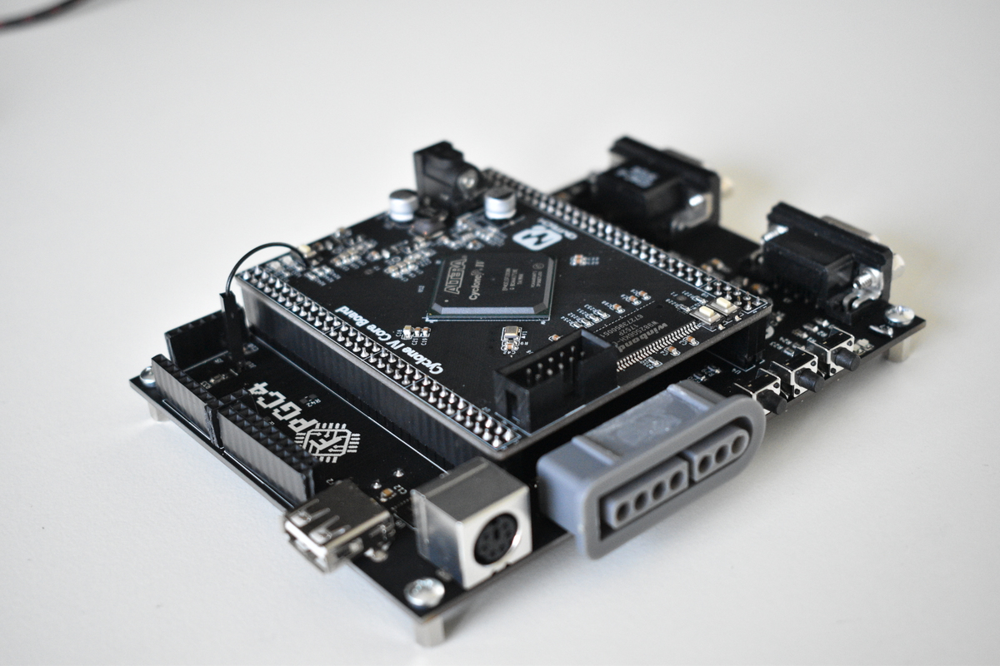
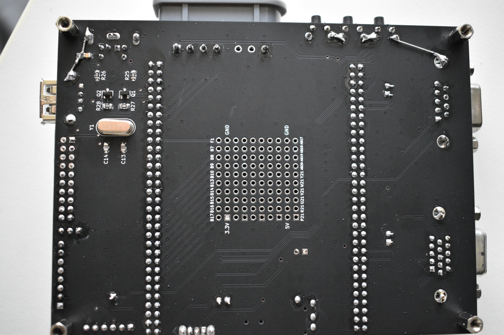
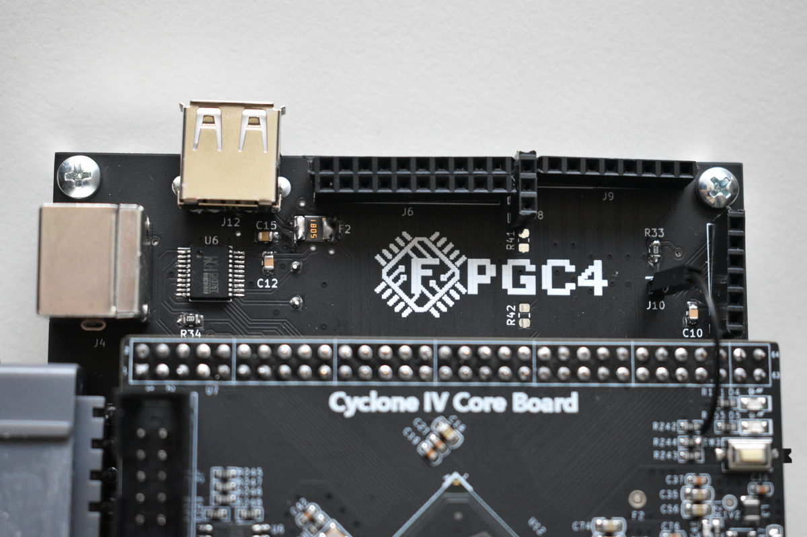

# FPGC4
In this file you will find all the documentation of this project.

# Table of contents
1. [Introduction](#introduction)
2. [Hardware description](#hardwareDesc)
    1. [Specifications](#specs)
    2. [Architecture](#arch)
    3. [Memory map](#memorymap)
    4. [CPU](#cpu)
    5. [MU](#mu)
    6. [GPU](#gpu)
3. [Bootloader](#bootloader)
4. [Assembler](#assembler)
5. [Quartus](#quartus)
6. [Programmer](#programmer)
7. [MIDI](#midi)
8. [I/O Wing](#iowing)
9. [More about the project](#moreInfo)


## Introduction <a name="introduction"></a>
The FPGC4 (Field Programmable Game Console v4) is the fourth version of my game console/PC that is implemented in an FPGA. It runs on a self designed CPU called the B322 (B4rt 32 bit processor v2) and a self designed GPU called the FSX2 (Frame Synthesizer v2). It has the performance of a computer from the 1980's, but with some newer features like a 32 bit CPU architecture with an 0.5GiB address space, and a clock speed of 25MHz.

### Why?
Nowadays computers are so immensely complex that it is hard to understand how they actually work. There are so many layers of abstraction, like CPU Microcode, BIOS and the Operating System, that it is hard to imagine how things works at a low level. As a Computer Science student, I usually am only working on higher level software, and not on hardware. So to answer questions like "What does a CPU do at each clock cycle?", "How does a CPU access different kinds of memory with different latencies?", "How does the CPU talk to the GPU?" and "How does a GPU render an image on the display?", I started this project to design a computer myself. 

So the goal of this project is to understand how a computer works at a very low level, by designing and building one myself. 

### How?
Since I want to design my own hardware like a CPU and GPU, I need a way to actually build them. And since I do not own a factory that can make chips, and I do not want to buy and solder a bajillion transistors or logic ICs, I needed a magical device that allows me to create my own chips. Luckily, such magical device exists, and it is called an FPGA (Field Programmable Gate Array). An FPGA is a chip that consists out of many *configurable* logic building blocks. It usually has many pins to connect to other hardware, just like an Arduino. Aside from logic blocks, it usually also has some blocks of SRAM, and some other handy hardware like PLLs (for clock signal generation) and hardware multipliers. FPGAs are usually "programmed" using a hardware description language (HDL) like VHDL or Verilog. These languages allow you (but do not require you) to abstract a bit away from the flip-flops and logic gates, but not by much. They allow you to design pretty complex hardware while still giving the designer control about what happens at each clock cycle. The most important part of these HDLs, is that you can use a simulator to "see inside the chip" and see what signals are high or low at any point in time! For this project, I chose Verilog, since it looked a bit more like "normal" programming languages like C. Eventually, this appeared to be a good decision, since the simulation models of the SDRAM and SPI flash I used for this project were also written in Verilog.

### Performance
Because current computers are so complex, it would be unfeasible for me, with no prior hardware design experience, to design a fast computer that will eventually run Windows or Linux. So I focused more on PCs and game consoles from around 1980, like the Commodore 64 and Nintendo Entertainment System (NES), since those are a lot less complex than the ones we have now. Using an FPGA from somewhere around 2010 built on a 60nm process instead of a few um process from the 1980's, allows me to add some features that were not usual in the 1980's. So instead of an 8 bit CPU architecture, I chose for an 32 bit architecture, so I can add more stuff in each instruction, vastly increasing the throughput of the CPU. The FPGA also allows me to use a 25MHz clock instead of a 1MHz CPU like the Commodore 64 uses. My FPGA board also has a 32MiB SDRAM chip, which is a huge amount of memory compared to something like a Commodore 64 or NES. Furthermore, the 32 bit architecture allowed me to have a huge address space (currently 0.5GiB). It is important to note that because of the way I designed the architecture of the CPU and MU (Memory Unit), it is impossible to use pipelining to increase the performance. Complex tricks like pipelining and branch prediction were never the goal of this project and therefore will probably never be implemented.

So as a performance reference, one should expect something similar to a Commodore 64 or NES.

### FPGA Board
There are different FPGA chips from different vendors, and there are many different development boards. The one I chose for this project is the [Cyclone IV EP4CE15 Core Board with 32MiB SDRAM from QMtech from Aliexpress](https://www.aliexpress.com/i/32949281189.html). The old revision of this board uses SDRAM from Micron. This old revision is the board I initially designed this project for. The newer revision uses Winbond SDRAM. I currently use the newer revision board and the Winbond chip is completely compatible with my SDRAM controller.


## Hardware description <a name="hardwareDesc"></a>

### Specifications <a name="specs"></a>
These are the current specifications of the FPGC4:

- 25MHz CPU clock   
- 6.63MHz GPU clock
- 16MiB SPI flash (QSPI) @ 25MHz. 32bit addresses. Read only
- 32MiB SDRAM @ 25MHz. 32bit addresses. Readable and writable, used as main memory
- ~16.4KiB VRAM (SRAM). Combination of 32, 9 and 8bit addresses
- 2KiB ROM as bootloader. 32bit addresses
- 4.125KiB Stack. 32bit addresses
- 16 32bit registers
- 32bit instructions
- 27bit program counter, for a possible address space of 0.5GiB at 32bit
- 320x240 video with 256 colors using 8x8 tiles
- Video rendered over RGBs signal for CRT tv's using 'RGB scart'
- Three CTC timers, third timer currently not attached to an interrupt
- 4 interrupt pins (currently attached to two timers, UART rx and the frameDrawn signal of the FSX2)
- 2 square wave tone generators with each 4 tones

### Computer Architecture <a name="arch"></a>
The FPGC4 consists of three main parts: the CPU, GPU and MU.

The CPU, called the B322, is the main part that executes all instructions. It reads and writes to the MU. The CPU consists of an timer that handles the timing of the CPU phases, an instruction decoder that splits the 32 bits of each instructions, an PC unit that handles all program counter related functions like jumps and interrupts, an ALU that can do 16 different operations on two 32 bit inputs, a register bank that contains 16 32 bit registers, a stack and finally a control unit that directs certain signals based on the instruction.
 
The GPU, called the FSX2, is completely separate from the CPU. It contains the logic for generating a video signal and for creating an image on this signal based on the contents of VRAM. The GPU has its own read port with clock on the VRAM, since all of it is true dual port SRAM, allowing it to run on a completely different clock domain than the rest of the FPGC4.

The MU, or memory unit, handles all memory access between the CPU and all the different memories used in the FPGC4. These memories includes: SDRAM, SPI flash, internal ROM, 8 bit VRAM, 9 bit VRAM, 32 bit VRAM and a lot of I/O. It makes use of a memory map. The goal of the MU is to have the CPU access all memories without the CPU having to care about the type or timing of the memory, making an easy memory interface for the CPU. This is achieved using a start signal from the CPU to the MU to indicate the start of a memory read or write, and a busy signal from the MU to the CPU which only goes high when the start signal is received, and goes low when the data is read or written. However, there is one cycle of overhead per operation on the MU.

Because there is no separation between program data and instruction data, this computer design uses the Von Neumann architecture.

Block diagram of FPGC4:

```
                  +---------------------+
                  |                     |
                  |        B322         |
                  |         CPU         |
                  |                     |
                  |                     |
                  +---------------------+
                             ^
                             |
                             v
+---------+       +---------------------+       +---------+       +---------+
|         |       |                     |       |         |       |         |
|  SDRAM  |<----->|                     |       |         |       |         |
|         |       |                     |       |         |       |         |
+---------+       |                     |       |         |       |  FSX2   |
                  |       Memory        |<----->|  VRAM   |<----->|   GPU   |
+---------+       |        Unit         |       |         |       |         |
|         |       |                     |       |         |       |         |
|   ROM   |<----->|                     |       |         |       |         |
|         |       |                     |       |         |       |         |
+---------+       +---------------------+       +---------+       +---------+
                        ^          ^  
                        |          |
                        v          v
                    +-------+  +-------+ 
                    |       |  |       |
                    |  SPI  |  |  I/O  |
                    | flash |  |       |
                    |       |  +-------+
                    +-------+
```

#### Memory map <a name="memorymap"></a>
There are two different memory maps. One for the CPU and one for the GPU.

##### CPU memory map
This memory map is used when the CPU accesses memory

```
$000000 +------------------------+ 
        |                        | 
        |         SDRAM          | 
        |                        | $7FFFFF 
$800000 +------------------------+ 
        |                        | 
        |       SPI FLASH        | 
        |                        | $BFFFFF 
$C00000 +------------------------+ 
        |                        | 
        |         VRAM32         | 
        |                        | 
        | $C00000                | 
        |     Pattern Table      | 
        |                $C003FF | 
        |                        | 
        | $C04000                | 
        |     Palette Table      | 
        |                $C0041F | 
        |                        | $C0041F 
$C00420 +------------------------+ 
        |                        | 
        |         VRAM8          | 
        |                        | 
        | $C00420                | 
        |    BG Pattern Table    | 
        |                $C00C1F | 
        |                        | 
        | $C00C20                | 
        |    BG Palette Table    | 
        |                $C0141F | 
        |                        | $C02421 
        | $C01420                | 
        |  Window Pattern Table  | 
        |                $C01C1F | 
        |                        | 
        | $C01C20                | 
        |  Window Palette Table  | 
        |                $C0241F | 
        | $C02420                | 
        |       Parameters       | 
        |                $C02421 |  
        |                        | $C02421 
$C02422 +------------------------+ 
        |                        | 
        |          ROM           | 
        |                        | $C02621
$C02622 +------------------------+ 
        |                        | 
        |          I/O           | 
        |                        |
        | NESpad         $C02622 |
        | Keyboard[0]    $C02623 |
        | Keyboard[1]    $C02624 |
        | Keyboard[2]    $C02625 |
        | Timer1_val     $C02626 |
        | Timer1_ctrl    $C02627 |
        | Timer2_val     $C02628 |
        | Timer2_ctrl    $C02629 |
        | Timer3_val     $C0262A |
        | Timer3_ctrl    $C0262B |
        | TonePlayer1    $C0262C |
        | TonePlayer2    $C0262D |
        | UART tx        $C0262E |
        | UART rx        $C0262F |
        | GPIO           $C02630 |
        | SPI (CH376s)   $C02631 |
        |                        |
        |                        | $C02631 
$C02632 +------------------------+ 
        |                        | 
        |       SpriteVRAM       |   
        |                        | $C02731 
        +------------------------+ 

```

##### GPU memory map
This memory map is only used in the GPU
```
VRAM32
$000  +------------------------+ 
      |                        | 
      |     Pattern Table      | 
      |                        | $3FF
$400  +------------------------+ 
      |                        |
      |     Palette Table      |
      |                        | $41F
      +------------------------+


VRAM8
$000  +------------------------+
      |                        | 
      |     BG Tile Table      | 
      |                        | $7FF
$800  +------------------------+ 
      |                        |
      |     BG Color Table     |
      |                        | $FFF
$1000 +------------------------+
      |                        | 
      |   Window Tile Table    | 
      |                        | $17FF
$1800 +------------------------+ 
      |                        |
      |   Window Color Table   |
      |                        | $1FFF
$2000 +------------------------+
      |                        |
      |       Parameters       |
      |                        | $2001
      +------------------------+

SpriteVRAM
$000  +------------------------+
      |                        | 
      |    %0: X pos           | 
      |    %1: Y pos           | 
      |    %2: Tile            | 
      |    %3: Palette+flags   | 
      |                        | $FF
      +------------------------+ 
```

#### CPU (B322) <a name="cpu"></a>
The B322 (B4rt 32 bit processor v2) executes instructions from memory with the program counter as address. It is a 32 bit RISC CPU implementing the BR322 instruction set

##### B322 ISA
The B322 instruction set architecture is a RISC architecture.
Each instruction is 32 bits and can be one of the following instructions:
```
         |31|30|29|28|27|26|25|24|23|22|21|20|19|18|17|16|15|14|13|12|11|10|09|08|07|06|05|04|03|02|01|00|
----------------------------------------------------------------------------------------------------------
1 HALT     1  1  1  1| 1  1  1  1  1  1  1  1  1  1  1  1  1  1  1  1  1  1  1  1  1  1  1  1  1  1  1  1
2 READ     1  1  1  0||----------------16 BIT CONSTANT---------------||--A REG---| x  x  x||I||--D REG---|
3 WRITE    1  1  0  1||----------------16 BIT CONSTANT---------------||--A REG---||--B REG---| x  x  x  x
4 COPY     1  1  0  0||----------------16 BIT CONSTANT---------------||--A REG---||--B REG---| x  x  x  x
5 PUSH     1  0  1  1| x  x  x  x  x  x  x  x  x  x  x  x  x  x  x  x  x  x  x  x |--B REG---| x  x  x  x
6 POP      1  0  1  0| 0  0  0  x  x  x  x  x  x  x  x  x  x  x  x  x  x  x  x  x  x  x  x  x |--D REG---|
7 JUMP     1  0  0  1||--------------------------------27 BIT CONSTANT--------------------------------||O|
8 JUMPR    1  0  0  0||----------------16 BIT CONSTANT---------------| x  x  x  x |--B REG---| x  x  x |O|
9 LOAD     0  1  1  1||----------------16 BIT CONSTANT---------------| x  x  x |H| x  x  x  x |--D REG---|
10 BEQ     0  1  1  0||----------------16 BIT CONSTANT---------------||--A REG---||--B REG---| x  x  x  x
11 BNE     0  1  0  1||----------------16 BIT CONSTANT---------------||--A REG---||--B REG---| x  x  x  x
12 BGT     0  1  0  0||----------------16 BIT CONSTANT---------------||--A REG---||--B REG---| x  x  x  x
13 BGE     0  0  1  1||----------------16 BIT CONSTANT---------------||--A REG---||--B REG---| x  x  x  x
14 SAVPC   0  0  1  0| 0  0  0  x  x  x  x  x  x  x  x  x  x  x  x  x  x  x  x  x  x  x  x  x |--D REG---|
15 RETI    0  0  0  1| x  x  x  x  x  x  x  x  x  x  x  x  x  x  x  x  x  x  x  x  x  x  x  x  x  x  x  x
16 ARITH   0  0  0  0||C||--OPCODE--||--------11 BIT CONSTANT--------||--A REG---||--B REG---||--D REG---|
```

1.  HALT:   Will prevent the CPU to go to the next instruction by jumping to the same address. Can be interrupted.
2.  READ:   If !I, read from memory at address in AREG + 16 bit offset. If I, read interrupt ID. In both cases: store value in DREG.
3.  WRITE:  Write value from BREG to memory at address stored in AREG + 16 bit offset.
4.  COPY:   Read memory from address in AREG + 16 bit offset, then write result to memory at address in BREG + 16 bit offset.
7.  PUSH:   Pushes value in AREG to stack.
8.  POP:    Pops value from stack into DREG.
9.  JUMP:   Set PC to 27 bit constant if O is 0. If O is 1, then add the 27 bit constant to PC. 
9.  JUMR:   Set PC to DREG + 16 bit constant if O is 0. If O is 1, then add the value from DREG + 16 bit constant to PC. 
5.  LOAD:   Write 16 bit constant to DREG. If H is 0, then write data to lowest 16 bits and set highest 16 bits to 0. If H is 1, then write data to highest 16 bits and ignore lowest 16 bits.
11. BEQ:    If AREG == BREG, add 16 bit constant to PC.
12. BNE:    If AREG != BREG, add 16 bit constant to PC.
13. BGT:    If AREG >  BREG, add 16 bit constant to PC.
14. BGE:    If AREG >= BREG, add 16 bit constant to PC.
15. SAVPC:  Save current PC to DREG.
16. RETI:   Restore PC after interrupt and re-enable interrupts.
10. ARITH:  Execute operation specified by OPCODE on AREG and BREG. Write result to DREG. Use 11-bit constant in stead of BREG if C is 1.

##### Components
The CPU consists out of the following components:

###### Timer
Handles the timing of the CPU phases.

The Timer creates four phases for the CPU to execute each instruction:

1. fetch: Get instruction from memory
2. getRegs: Get register values from register bank
3. readMem: Read memory from address
4. writeBack: Write result back to register bank or memory and change the program counter

The fetch, readMem and writeBack phase can take multiple clock cycles because of the memory timings.
Because of the current memory access design, it is fundamentally impossible to pipeline instructions. This was never a goal of this project.

###### Instruction Decoder
Splits the 32 bits of each instructions.

These parts are then connected to various other components of the CPU. 
The instruction decoder does not use a clock.

###### Regbank
Contains 16 32 bit registers.

The 16 32 bit registers have the current functions:
```
0 : Always zero
1 : GP/Argument or retval
2 : GP/Argument or retval
3 : GP/Argument or retval
4 : GP
5 : GP
6 : GP
7 : GP
8 : GP
9 : GP
10: GP
11: GP
12: GP
13: GP
14: GP
15: Return pointer/GP
```
The register bank has two read ports and one write port. Internally on the FPGA, the registers are implemented as two block RAM modules. One module contains the highest 16 bits, the other the lowest 16 bits.

###### Stack
Stack memory with internal stack pointer. The stack is mostly used for jumping to functions and backing up or restoring registers in interrupt handlers or functions. In combination with the SavPC instruction, one can jump to (and return from) functions.

The stack is 1024 words deep. The stack pointer is not accessible by the rest of the CPU. The pointer wraps around in case of a push when the stack is full or in case of a pop when the stack is empty.

In case a bigger stack or stack pointers are required, a software stack implementation using the 32MiB SDRAM main memory is advised.

###### ALU
Can execute 16 different operations on two 32 bit inputs. Has two flags.
/Argument or retval/Argument or retval
The 4 bit opcode can specify the following operations:
```
Operation|Opcode|Description
-------------------------
  OR       0000  A OR   B
  AND      0001  A AND  B
  XOR      0010  A XOR  B
  ADD      0011  A  +   B
  SUB      0100  A  -   B
  SHIFTL   0101  A  <<  B
  SHIFTR   0110  A  >>  B
  NOTA     0111  ~A
  MULT     1000  A  *   B
```

The remaining seven Opcodes are reserved for future (maybe signed?) operations.

Internally, the CPU uses flags for executing the branch instructions. However these are not readable by other instructions, because they are not saved in a register:
```
Flags
---------
BGA: B is greater than A
BEA: B is equal to A
```

###### PC
Handles all program counter related functions like jumps and interrupts.

Every writeBack cycle, the PC is increased by one. In case of a jump, the PC is set to or increased by the jump address.

The CPU has 8 interrupt pins, of which 4 standard interrupts and 4 extended interrupts (extended has nothing to do with the duration of the interrupt, see it as an interrupt extension). When a rising edge on one of these pins is detected and interrupts are enabled, interrupts will be disabled, the PC will be stored and the set to the value of the interrupt pin (1, 2, 3, or 4, and 2 in case of an extended interrupt). When a RETI instruction is issued, the PC will be restored and interrupts re-enabled. Interrupts are only registered on the rising edge, to prevent the same interrupt from repeating itself when the handler is already done, but the signal is still high. In case of multiple interrupts at the same time, the lowest pin number has the highest priority. Interrupt 1 to 4 have priority over the extended interrupts. A flag for each rising interrupt is stored, even when interrupts are disabled. This causes the interrupt to be delayed until interrupts are enabled again. This way no interrupts are skipped.

For the extended interrupts, the PC will still jump to address 2, but will also set an ID. This way the interrupt handler can check which interrupt was triggered. The ID can be read using the I (interrupt) flag in the READ instruction.

###### CU
The CU, or control unit, directs all signals to the corresponding components based on the instruction.

#### MU <a name="mu"></a>
The MU, or memory unit, handles all memory access between the CPU and all the different memories used in the FPGC4. The MU makes use of a memory map so it knows from or to which memory it should read or write. The goal of the MU is to have the CPU access all memories without the having to care about the type or timing of the memory, making an easy memory interface for the CPU. This is achieved using a start signal from the CPU to the MU to indicate the start of a memory read or write, and a busy signal from the MU to the CPU which only goes high when the start signal is received, and goes low when the data is read or written. However, there is one cycle of overhead per operation on the MU.

The MU is connected to the following memories:

##### SPI flash
The SPI flash contains the program of FPGC4, since it is located on a modular chip which can be easily removed and then reprogrammed by something like an Arduino. The size of the flash currently in use is 16MiB. The MU makes use of an SPI flash controller which accesses the flash chip in quad SPI mode with continuous reading for faster performance. The maximum speed without modifying the amount of dummy clocks for each read is 25MHz, which is currently the speed of most of the FPGC4, which is very convenient. Only read instructions are implemented, so no writing or erasing is possible on the FPGC4 (this is by design). Because of the SPI interface, it takes many cycles to read one 32 bit instruction. Therefore, the contents are copied to the faster SDRAM by the bootloader. While the SPI flash chip uses 8 bit addresses internally, the controller can be addressed by 32 bit words. The values of 'empty' addresses are all ones.

To test the timing system, I added a simulation model of a W25Q128JV SPI chip, which is compatible with the W25Q128BV I use in hardware. The SPI flash controller reads from this chip when a trigger occurs. When done reading it sets the recvDone signal high. Before all of this can happen, the chip has to be initialized. This is done by sending a 'reset continuous reading' command and a read command with the continuous reading bits set. This way each read does not have to start with an 8 cycle instruction. After initialization, an initDone signal is set high. When the MU gets a request from the CPU to read from SPI flash while the chip is not initialized yet, then the MU will wait until initialization is done before reading.

##### SDRAM
The SDRAM is used as the main memory for the FPGC4. It has a size of 32MiB. Since it is SDRAM, it requires a controller that handles all access and refreshes. The MU contains such controller to interface with the SDRAM. During initialization, the chip is set to a CAS latency of 2 and a programmable burst length of 2 (since we have 32 bit words, and the chip uses 16 bit data). The controller also handles refreshes. To reduce the amount of latency, the MU sets its busy flag low right after the read data is available or the written data is sent to the SDRAM chip. This way the CPU does not have to wait for row closing operations to be performed. If the MU gets a request from the CPU to read from or write to SDRAM, while the SDRAM controller is busy, then the MU will wait until the SDRAM controller is ready. While the SDRAM chip uses 16 bit addresses internally, the controller can be addressed by 32 bit words. The data of the SDRAM at powerup is undefined, but probably zero.

The first addresses of the SDRAM contain the program copied from SPI flash by the bootloader. I also added a simulation model of the SDRAM to the project. The currently used SDRAM chip is the Winbond W9825G6KH-6 (an older revision uses the Micron MT48LC16M16A2 chip. I originally started with this chip and it also works. The Verilog SDRAM simulation model is even based on Micron chip).

##### ROM
Internally on the FPGA, 2KiB of SRAM/Block RAM is used as ROM. It contains the bootloader of the FPGC4, which copies data from SPI flash to SDRAM, and jumps to SDRAM. This code is read only and can only be modified by reprogramming the FPGA.

##### VRAM32
VRAM32 is the 32 bit wide dual port dual clock video RAM used by the CPU and the GPU. It contains the pattern table and palette table for the GPU. It is implemented using internal SRAM/Block RAM. There are two VRAM32 modules in use at the same time (the contents are duplicated), allowing the Background/Window and Sprite rendering part of GPU to access the memory at the same time. This greatly reduces the complexity of the GPU while only slightly increasing the block RAM usage.
The values of this memory at power up are all zero.

##### VRAM8
VRAM8 is the 8 bit wide dual port dual clock video RAM used by the CPU and the GPU. It contains the background tile table, background color table, window tile table and window color table for the GPU. It is implemented using internal SRAM/Block RAM. The final two addresses are the horizontal tile offset and horizontal pixel offset for scrolling.
The values of this memory at power up are all zero.

##### SpriteVRAM
SpriteVRAM is the 9 bit wide dual port dual clock video RAM used by the CPU and the GPU. It contains the sprite table for the GPU. It is implemented using internal SRAM/Block RAM. The memory has room for 64 sprites, where each sprite as a separate address for X position, Y position, tile index and color index+flags.
The values of this memory at power up are all zero.

##### I/O
All other I/O devices are mapped to the I/O memory block. The following list describes the currently attached I/O devices.

###### NESpad
A NES/SNES controller reader. Tested with both NES and SNES controllers. All button pressed states are written to a 16 bit register, and is readable from the memory map. The button values are stored on the right side of the 32 bit word.
```
TODO: Test the button values!!!
Button | Bit
------------------
A      | 00000000000X
B      | 0000000000X0
Sel    | 000000000X00
Start  | 00000000X000
Up     | 0000000X0000
Down   | 000000X00000
Left   | 00000X000000
Right  | 0000X0000000
X      | 000X00000000
Y      | 00X000000000
L      | 0X0000000000
R      | X00000000000
```

###### PS/2 Keyboard
A PS/2 Keyboard reader. Reads 79 buttons from the keyboard. The pressed states are readable from three adjacent addresses on the memory map.
```
TODO: change this to just read the keycodes and interrupt the FPGC4, and do the rest in software (library) for stability and space.
```
###### Timer
The timer can be used to generate an interrupt after a programmable amount of time. Each timer has to memory addresses. One specifies the time in milliseconds, the other one is a status register used for starting or stopping the timer.

###### Tone player
The tone player can play up to four notes at the same time. It generates square wave tones based on the contents written to the tone player via the memory map. Each 8 bits in the 32 bit data represents a note. Using the MidiConverter program it is possible to convert some basic MIDI's to note indexes.

###### UART
Using the addresses mapped on the UART RX and UART TX modules, it is possible to communicate with devices like a PC using UART. The baud rate is always set to 115200. When a byte is received, an interrupt is triggered and the byte can be read from the memory map.

###### SPI (CH376)
The SPI module is specifically made for hardware SPI mode. The chip select pin is currently unattached and should be used using GPIO pins so transferring multiple bytes per SPI transfer is possible. This module is currently attached to the CH376 USB chip for mass storage.

Using the CH376T USB controller chip over SPI, it is relatively simple to read and write files to an USB stick with a FAT partition table. It is also possible to do other things, like reading USB MIDI keyboards and HID devices. 

###### GPIO
This one address on the memory map is mapped to GPIO pins on the FPGA. Only the right 16 bits are used. The left 8 of these 16 bits are read only and are the state of the 8 input ports. The right 8 of these 16 bits are the state of the 8 output ports. The output ports can also be read.
```
TODO: Make a list pins with bit value and in/out
```
#### GPU (FSX2) <a name="gpu"></a>
The GPU generates a progressive 320x240@60hz RGBs signal using a pixel clock of 6.6MHz. The timing of the video signal is as follows:
```
  H_RES   = 320,      // horizontal resolution (pixels)
  V_RES   = 240,      // vertical resolution (lines)
  H_FP    = 24,       // horizontal front porch
  H_SYNC  = 32,       // horizontal sync
  H_BP    = 46,       // horizontal back porch
  V_FP    = 3,        // vertical front porch
  V_SYNC  = 5,        // vertical sync
  V_BP    = 14,       // vertical back porch
  H_POL   = 0,        // horizontal sync polarity (0:neg, 1:pos)
  V_POL   = 0;        // vertical sync polarity


H_TOTAL = 320+24+32+46  = 422 //Horizontal total pixels
V_TOTAL = 240+3+5+14    = 262 //Vertical total lines

422 pixels * 262 lines * 60 FPS = 6.633840 MHz (6.632653MHz works fine)
PLL is configured to multiply 50MHz by 13, and divide it by 98
```
The GPU basically uses a tile based rendering system inspired by the NES PPU in order to save video RAM, since the FPGA only as a few KB of SRAM/block RAM. Tile rendering works as follows:

For each tile, the GPU has to read the BG Tile table, Pattern table, BG Color table, Palette table, Window Tile table, Pattern table, Window Color table and Palette table (in this order) to know which color to draw.
The Pattern table allows for 256 different tiles.
The Palette table allows for 32 different palettes with four colors per palette.
Each address in the tile tables and the color tables is mapped to one tile on screen.

The GPU draws the following three layers:

##### Background
The background layer consists of 512x240 pixels. They are indexed by tiles of 8x8 pixels making 64x30 tiles. The background is horizontally scrollable by using the tile offset parameter and fine offset parameter. The tile offset parameter specifies how many tiles the background has to be scrolled to the left. The fine offset parameter specifies how many pixels (ranging from 0 to 7) the background has to be scrolled to the left. The background wraps around horizontally.

##### Window
The window layer consists of 320x240 pixels. They are indexed by tiles of 8x8 pixels making 40x30 tiles. The window is not scrollable and is rendered above the background. When a pixel is black, it will not be rendered which makes the background visible. The window is especially useful for static UI things like text, score and a life bar for example.

##### Sprites
The sprite layer can consist of a maximum of 64 sprites. Only 16 of these sprites can be rendered on the same horizontal line. Each sprite has four different addresses that can be written to, with the following functions:
1. X position (9 bits)
2. Y position (8 bits)
3. Tile index (8 bits)
4. Color index (5 bits), hflip, vflip, priority, disable (all 1 bit)
hflip, vflip, priority and disable are currently not implemented.
The sprites are rendered on top of the window and background layers. When a pixel is black, it will not be rendered which makes the window or background visible. Sprites are useful for things that move per pixel on the screen independently, such as the ball in pong or a mouse cursor.


## Bootloader code <a name="bootloader"></a>
The bootloader is the first thing that is executed by the CPU. The bootloader is used to copy data from the slow SPI flash to the faster SDRAM, and to jump to address 0 on the SDRAM. Since the bootloader has room for 512 instructions, I will probably add a boot screen with logo.
There are two modes for the bootloader:
- If GPI[0] is high (which should be by default, because of a pull-up resistor), then the bootloader will only copy the first 16 addresses, and the last 512 addresses. This is because the code of the UARTbootloader has to run at the end of the 16'th MiB of the SPI flash to prevent that the bootloader overwrites its own code (since it is ran from SDRAM). If all 16MiB is copied, then the copying would take about ten seconds, which is way to long. By only copying the start and end, the UARTbootloader still works, and is copied almost instantly.
- If GPI[0] is low, then the bootloader will copy X addresses, where X is the number in (32 bit) address 5 of the SPI flash.

I chose to make the UART mode the default mode, since this mode is currently used >99% of the time. This will likely change when I have developed an OS.
Furthermore, all registers are reset before jumping to address 0, because the UARTbootloader has to halt in the first instruction and therefore has to assume all registers are empty. The code could be space optimized by jumping to one of the two clear registers code, if needed.

<details>
<summary>The assembly code of the bootloader</summary>

```
load 0x2630 r1
loadhi 0xC0 r1          ; r1 = GPIO address: 0xC02630
read 0 r1 r2            ; r2 = GPIO values
load 0b00000001 r3      ; r3 = bitmask for GPI[0]
and r2 r3 r3            ; r3 = GPI[0]

; if GPI[0] is high (button has pullup), then jump to UART optimized copy function
beq r0 r3 2
    jump CopyUartLoader


load 0 r1
loadhi 0x80 r1          ; r1 = address 0 of SPI: 0x800000
load 0 r2               ; r2 = address 0 of SDRAM: 0x00, and loop var
read 5 r1 r3            ; r3 = last address to copy +1, which is in line 6 of SPI code

CopyLoop:
    copy 0 r1 r2            ; copy SPI to SDRAM

    add r1 1 r1             ; incr SPI address 
    add r2 1 r2             ; incr SDRAM address

    beq r2 r3 2             ; copy is done when SDRAM address == number of lines to copy
    jump CopyLoop           ; copy is not done yet, copy next address

; clear registers
load 0 r1
load 0 r2
load 0 r3
load 0 r4
load 0 r5
load 0 r6
load 0 r7
load 0 r8
load 0 r9
load 0 r10
load 0 r11
load 0 r12
load 0 r13
load 0 r14
load 0 r15

jump 0                  ; copy is done, jump to sdram
halt                    ; should not get here, halt if we do


CopyUartLoader:

    load 0 r1
    loadhi 0x80 r1          ; r1 = address 0 of SPI: 0x800000
    load 0 r2               ; r2 = address 0 of SDRAM: 0x00, and loop var
    read 5 r1 r3            ; r3 = last address to copy +1, which is in line 6 of SPI code
    load 16 r4              ; r4 = number of words to copy at the start

    CopyStartLoop:
        copy 0 r1 r2            ; copy SPI to SDRAM

        add r1 1 r1             ; incr SPI address 
        add r2 1 r2             ; incr SDRAM address

        beq r2 r4 2             ; copy is done when SDRAM address == number of words to copy at the start
        jump CopyStartLoop      ; copy is not done yet, copy next address


    load 0 r1
    loadhi 0x80 r1          ; r1 = address 0 of SPI: 0x800000
    load 0 r2               ; r2 = address 0 of SDRAM: 0x00, and loop var
    read 5 r1 r3            ; r3 = last address to copy +1, which is in line 6 of SPI code
    sub r3 512 r4           ; r4 = starting address, 512 addresses before last address
    add r4 r1 r1            ; apply starting address offset to SPI address
    add r4 r2 r2            ; apply starting address offset to SDRAM address

    CopyEndLoop:
        copy 0 r1 r2            ; copy SPI to SDRAM

        add r1 1 r1             ; incr SPI address 
        add r2 1 r2             ; incr SDRAM address

        beq r2 r3 2             ; copy is done when SDRAM address == number of lines to copy
        jump CopyEndLoop        ; copy is not done yet, copy next address

    ; clear registers
    load 0 r1
    load 0 r2
    load 0 r3
    load 0 r4
    load 0 r5
    load 0 r6
    load 0 r7
    load 0 r8
    load 0 r9
    load 0 r10
    load 0 r11
    load 0 r12
    load 0 r13
    load 0 r14
    load 0 r15

    jump 0                  ; copy is done, jump to sdram
    halt                    ; should not get here, halt if we do
```

</details>


<details>
<summary>Binary code of bootloader (with comments)</summary>

```
01110010011000110000000000000001 //Set r1 to 0x2630   (this is address 0xC02422)
01110000000011000000000100000001 //Set highest 16 bits of r1 to 0xC0
11100000000000000000000100000010 //Read at address in r1 with offset 0 to r2
01110000000000000001000000000011 //Set r3 to 0b00000001
00000000100000000000001000110011 //Compute r2 AND r3 and write result to r3
01100000000000000010000000110000 //If r0 == r3, then jump to offset 2
10010001100000000100100010000110 //Jump to load r1 instruction in line 34 (0xC02422 + 34 - 1)
01110000000000000000000000000001 //Set r1 to 0
01110000000010000000000100000001 //Set highest 16 bits of r1 to 0x80
01110000000000000000000000000010 //Set r2 to 0
11100000000000000101000100000011 //Read at address in r1 with offset 5 to r3
11000000000000000000000100100000 //Copy from address in r1 to address in r2 with offset 0
00001001100000000001000100000001 //Compute r1 + 1 and write result to r1
00001001100000000001001000000010 //Compute r2 + 1 and write result to r2
01100000000000000010001000110000 //If r2 == r3, then jump to offset 2
10010001100000000100100001011010 //Jump to copy instruction in line 12 (0xC02422 + 12 - 1)
01110000000000000000000000000001 //Set r1 to 0
01110000000000000000000000000010 //Set r2 to 0
01110000000000000000000000000011 //Set r3 to 0
01110000000000000000000000000100 //Set r4 to 0
01110000000000000000000000000101 //Set r5 to 0
01110000000000000000000000000110 //Set r6 to 0
01110000000000000000000000000111 //Set r7 to 0
01110000000000000000000000001000 //Set r8 to 0
01110000000000000000000000001001 //Set r9 to 0
01110000000000000000000000001010 //Set r10 to 0
01110000000000000000000000001011 //Set r11 to 0
01110000000000000000000000001100 //Set r12 to 0
01110000000000000000000000001101 //Set r13 to 0
01110000000000000000000000001110 //Set r14 to 0
01110000000000000000000000001111 //Set r15 to 0
10010000000000000000000000000000 //Jump to constant address 0
11111111111111111111111111111111 //Halt
01110000000000000000000000000001 //Set r1 to 0
01110000000010000000000100000001 //Set highest 16 bits of r1 to 0x80
01110000000000000000000000000010 //Set r2 to 0
11100000000000000101000100000011 //Read at address in r1 with offset 5 to r3
01110000000000010000000000000100 //Set r4 to 16
11000000000000000000000100100000 //Copy from address in r1 to address in r2 with offset 0
00001001100000000001000100000001 //Compute r1 + 1 and write result to r1
00001001100000000001001000000010 //Compute r2 + 1 and write result to r2
01100000000000000010001001000000 //If r2 == r4, then jump to offset 2
10010001100000000100100010010000 //Jump to copy instruction in line 39 (0xC02422 + 39 - 1)
01110000000000000000000000000001 //Set r1 to 0
01110000000010000000000100000001 //Set highest 16 bits of r1 to 0x80
01110000000000000000000000000010 //Set r2 to 0
11100000000000000101000100000011 //Read at address in r1 with offset 5 to r3
00001010001000000000001100000100 //Compute r3 - 512 and write result to r4
00000001100000000000010000010001 //Compute r4 + r1 and write result to r1
00000001100000000000010000100010 //Compute r4 + r2 and write result to r2
11000000000000000000000100100000 //Copy from address in r1 to address in r2 with offset 0
00001001100000000001000100000001 //Compute r1 + 1 and write result to r1
00001001100000000001001000000010 //Compute r2 + 1 and write result to r2
01100000000000000010001000110000 //If r2 == r3, then jump to offset 2
10010001100000000100100010101000 //Jump to copy instruction in line 51 (0xC02422 + 51 - 1)
01110000000000000000000000000001 //Set r1 to 0
01110000000000000000000000000010 //Set r2 to 0
01110000000000000000000000000011 //Set r3 to 0
01110000000000000000000000000100 //Set r4 to 0
01110000000000000000000000000101 //Set r5 to 0
01110000000000000000000000000110 //Set r6 to 0
01110000000000000000000000000111 //Set r7 to 0
01110000000000000000000000001000 //Set r8 to 0
01110000000000000000000000001001 //Set r9 to 0
01110000000000000000000000001010 //Set r10 to 0
01110000000000000000000000001011 //Set r11 to 0
01110000000000000000000000001100 //Set r12 to 0
01110000000000000000000000001101 //Set r13 to 0
01110000000000000000000000001110 //Set r14 to 0
01110000000000000000000000001111 //Set r15 to 0
10010000000000000000000000000000 //Jump to constant address 0
11111111111111111111111111111111 //Halt
```

</details>


## Assembler for B322 <a name="assembler"></a>
To simplify writing code for the B322, one can use the B322 assembly language.
The assembler compiles the assembly code to 32 bit machine instructions. The input file is currently code.asm, and the output is printed to stdout.

### Line types
Each line is parsed on its own. There are four types of lines:

- Includes
- Comments
- Defines
- Labels
- Instructions

#### Includes
By adding an \`include namehere.asm statement, it is possible to add code from other files, like libraries. The way this works in the assembler is by just adding all lines of that file to the code, while recursively importing includes from other files. The assembler makes sure that the same file is never included more than one time. The path to the file is relative to the assembler.

#### Comments
Comments can be added by using the ';' character. For each line, only the part until the first ';' occurrence will be used by the assembler. This means that anything can be written after the ';'. This all does not go for .ds lines. They must not have any comments. This way it is not needed to use escape characters in the strings

#### Defines
Defines are the first type of lines that are processed by the assembler. A define line should have the following structure:
```
define TEXTTOREPLACE = textToReplaceWith
```
It is not necessary for 'define' to be in lower caps and 'TEXTTOREPLACE' to be in all caps. However, it is recommended to do so as a coding style. Also, it is recommended to place all define statements at the top of the file before the first instruction or label.
The define statement is used as a textual replacement. This means that no values or anything will be processed or converted during the processing of the define statements. This also means that is not smart to replace text that are used in instructions or labels.
Furthermore, 'TEXTTOREPLACE' should be unique for each define statement. If not, the assembler will complain.

#### Labels
Labels can be used to get the address in the assembled code of the instruction below the label. To define a label, one should use the following syntax:
```
LabelName:
```
LabelName can consist of any character, including numbers and special characters, as long as it is just one word (so no spaces, newlines etc.) The label must end with a ':' character. On the same line after this ':' character, no other text is allowed, except comments.

A label can be referenced by using the LabelName in certain instructions at specific places (see section Instructions).
The assembler will eventually compute the address of the label and replace all LabelName occurrences with this address. One can make forward and backward references, which means that one does not have to define a label earlier in the code before referencing, as long as the label is defined somewhere in the code.

Each program should at least contain the following labels (if not, the assembler will complain):
```
Main: (this is where the CPU will initially jump to)
Int1: (interrupt 1 handler)
Int2: (interrupt 2 handler)
Int3: (interrupt 3 handler)
Int4: (interrupt 4 handler)
```

It is recommended to start each label with a capital letter, however this is not mandatory.
One should not use two labels directly after each other without any instruction in between, and one should not use a label at the end of the file. The assembler will complain if this happens.
When two identical labels are defined, the assembler will complain.
It does not matter if a label is never referenced.
However, it does matter when a reference is made to a label that is not defined. In that case the assembler will complain.
Each of the interrupt handler labels should 'end' with a reti instruction, otherwise the CPU will not return from the interrupt and could highly probably softlock. However, this is not checked by the assembler.

#### Instructions
The instructions are the lines that will be assembled into machine code. Each instruction has its own format with the following description:
```
Instr   | Arg1  | Arg2 | Arg3   || Description
================================||=====================================================================
HALT    |       |       |       || Halts CPU by jumping to the current address
READ    | C16   | R     | R     || Read from addr in Arg2 with 16 bit offset from Arg1. Write to Arg3
WRITE   | C16   | R     | R     || Write to addr in Arg2 with 16 bit offset from Arg1. Data to write is in Arg3
COPY    | C16   | R     | R     || Copy from address in Arg2 to addr in Arg3 with 16 bit offset from Arg1
PUSH    | R     |       |       || Push Arg1 to stack
POP     | R     |       |       || Pop from stack to Arg1
JUMP    | L/C27 |       |       || Jump to Label or 27 bit constant in Arg1
JUMPO   | C27   |       |       || Jump to 27 bit constant offset in Arg1
JUMPR   | C16   | R     |       || Jump to Arg2 with 16 bit offset in Arg1
JUMPRO  | C16   | R     |       || Jump to offset in Arg2 with 16 bit offset in Arg1
LOAD    | C16   | R     |       || Load 16 bit constant from Arg1 into Arg2
LOADHI  | C16   | R     |       || Load 16 bit constant from Arg1 into highest 16 bits of Arg2
BEQ     | R     | R     | C16   || If Arg1 == Arg2, jump to 16 bit offset in Arg3
BNE     | R     | R     | C16   || If Arg1 != Arg2, jump to 16 bit offset in Arg3
BGT     | R     | R     | C16   || If Arg1 >  Arg2, jump to 16 bit offset in Arg3
BGE     | R     | R     | C16   || If Arg1 >= Arg2, jump to 16 bit offset in Arg3
SAVPC   | R     |       |       || Save program counter to Arg1
RETI    |       |       |       || Return from interrupt
OR      | R     | C11/R | R     || Compute Arg1 OR  Arg2, write result to Arg3
AND     | R     | C11/R | R     || Compute Arg1 AND Arg2, write result to Arg3
XOR     | R     | C11/R | R     || Compute Arg1 XOR Arg2, write result to Arg3
ADD     | R     | C11/R | R     || Compute Arg1 +   Arg2, write result to Arg3
SUB     | R     | C11/R | R     || Compute Arg1 -   Arg2, write result to Arg3
SHIFTL  | R     | C11/R | R     || Compute Arg1 <<  Arg2, write result to Arg3
SHIFTR  | R     | C11/R | R     || Compute Arg1 >>  Arg2, write result to Arg3
MULT    | R     | C11/R | R     || Compute Arg1 *   Arg2, write result to Arg3
NOT     | C11/R | R     |       || Compute NOT Arg1, write result to Arg3
NOP     |       |       |       || Does nothing, is converted to the instruction OR r0 r0 r0
ADDR2REG| L     | R     |       || Loads address from Arg1 to Arg2. Is converted into LOAD and LOADHI
.DW     | N32   | *     | *     || Data: Each argument is converted to 32bit binary
.DD     | N16   | *     | *     || Data: Each argument is converted to 16bit binary **
.DB     | N8    | *     | *     || Data: Each argument is converted to 8bit binary **
.DS     | N8    | S     |       || Data: Each character of the string is converted to 8bit ASCII **

/   = Or
R   = Register
Cx  = Constant that fits within x bits
L   = Label
S   = String

*  Optional argument with same type as Arg1. Has 'no limit' on number of arguments
** Data is placed after each other to make blocks of 32 bits. If a block cannot be made, it will be padded by zeros
```

Each Cx type argument (constant) can be written in decimal, binary (with 0b prefix) or hex (with 0x prefix).

The assembler creates the first six lines of the program, since these are always the same instructions plus the length of the program:
```
Jump Main
Jump Int1
Jump Int2
Jump Int3
Jump Int4
*Length of program*
```

### Libraries
Using the include statements, you can include other files, which can be used as libraries.
I started on making a few libraries, which I explain here.

#### GFX.asm
Contains basic graphics functions like printing text and copying VRAM tables
Should write more here in the future.

#### STD.asm
Contains some standard functions. Currently only contains a function to convert a byte to a ASCII Hex string with 0x prefix.
Should write more here in the future.

#### UART.asm
Contains functions to send certain data over UART. Receiving is done in interrupts and therefore not included in this library.
Should write more here in the future.

#### SPI.asm
Library for writing and reading to the SPI module. Uses GPO[0] as CS and can read and send a byte. Should write more here in the future.

#### CH376.asm
Library for reading and writing files using the CH376 USB controller. Uses SPI for communication and UART/STD for debugging.
Currently not finished. Should write more here in the future.

### Assembling process
The assembler does the following things the the following order:

1. Remove all comments, while reading the input file line by line
2. Process the define statements
3. Compile all lines that can directly be compiled (so without labels)
4. Create new lines for instructions that become multiple lines
5. Process all labels
6. Recompile the lines that had a label before
8. calculate and write program length
7. Write result to output file

#### Input and output files
Currently one cannot pass arguments to the assembler. The assembler will read the code from code.asm and write the result to stdout. While arguments and file handling are easy to implement, I do not need it right now and have not plans to change this.

### Important notes
One important assumption is that the code will be executed from addr 0 of the SDRAM. Otherwise the label addresses will not be calculated correctly. In the future I might add an offset argument where all labels are offsetted by this argument, and a flag to disable the required Interrupt handlers

### Other things
I could create my own syntax highlighting for Sublime Text 3, however its Z80 syntax highlighting is already kinda decent. Might modify it in the future to support my assembly instead.

## Quartus <a name="quartus"></a>
The Quartus folder contains all files for actually implementing the FPGC4 into hardware on an FPGA. The targeted development board is the QMTECH EP4CE15 core board with 32MiB SDRAM.

There are some slight changes between the code in the Verilog folder and the code in the Quartus folder. For example, the Verilog folder contains simulation files for the SPI flash and SDRAM memory. The Quartus project is on the top level slightly modified to work on an actual FPGA. This also includes the use of PLLs for creating clocks.

The current design (as of writing this line in documentation) uses 8.4k LEs (55%), 110 pins, 1 PLL, 14 9-bit multipliers and 185kbit SRAM (35%).

## Programmer <a name="programmer"></a>
The Programmer folder contains all files related to programming the FPGC4 and the SPI flash (ROM). 

The compileROM.sh script converts the code.list file, the file with machine instructions, to the code.bin file. The file size will be a multiple of 4096 bytes, because the SPI flash programmer expects a file of this size. Now based on the last line of compileROM.sh, you can either flash the code.bin to the SPI flash (ROM) using an Arduino with flash.sh, or send the binary over UART to the FPGC4 using uartFlasher.py.

### flash.sh
To flash the SPI flash (ROM), I use an Arduino (In my case an Teensy 2.0) and the code from https://github.com/nfd/spi-flash-programmer (Credits to Nicholas FitzRoy-Dale). 
The flash.sh script requires two arguments: the serial port of the Arduino and the filename of the binary. The script will check how long the binary file is and use python3 to send the binary to the Arduino. To verify that the flash was successful, it will read the binary from the Arduino afterwards and compare it to the file that was sent.

### uartFlasher.py
The UART flasher is used to save A LOT of time by not having to turn off the FPGC4, take out the flash module, flash it with an Arduino, put it back in the FPGC4 and turn it back on. It sends the binary to the FPGC4 with an 115200 baud rate. However, this requires the inserted flash module to contain the SPI UART bootloader. Also the FPGC4 should boot in UART mode (see the bootloader section) to prevent having to wait for many seconds. One can quickly resend the code by pressing the soft-reset button on the FPGC4 (not the nConfig button), and sending the code over the serial port.

All of this works by using some fancy tricks in the SPI UART bootloader. The goal is to receive the bitstream from UART and copying it to SDRAM, starting from address 0, and jumping to address 0 after all bits are received. This gives the first problem: the bootloader should not overwrite itself, since it is also located and executed from SDRAM. Since the SPI flash is 16MiB big, we place all the copy instructions to the end of the SPI flash. The first instruction is a HALT, so the PC will always be at the instruction. All the copy instructions are executed from the UART receive interrupt. When a byte is received, it is placed on SDRAM starting from 16MiB. This way the first HALT instruction remains the same. After all bytes are copied, a timer interrupt is used to copy the SDRAM from 16MiB to 0MiB. Then, when the interrupt has ended, the PC will start from the first instruction (where the HALT used to be), which should now be the first instruction of the sent code. See UARTSPIbootloader.asm for the code (warning: large file, because of the offset).

## MIDI converter <a name="midi"></a>
The MIDI converter Python script can be used to convert basic MIDI files to notes and timings for the Timer and TonePlayer in the FPGC4. Only one channel is supported and not more than 4 notes should be played at the same time.

## I/O Wing <a name="iowing"></a>
I have designed an I/O wing for the FPGA development board, as a replacement for the cardboard box where I used to glue everything in. The PCB was designed using KiCad and manufactured by JLCPCB. The KiCad project files (including schematic, PCB and 3D models) are in the PCB folder.

### Design choices
During the development of the PCB, many design choices had to be made, which I will explain here.

#### Layout
I wanted to keep the PCB as small as possible, for practical and aesthetic reasons. The most practical way to do this was placing the core board on top and using all four sides of the PCB for I/O. I tried to place all the I/O on a logical position, so (diagonally) video, audio and power on one side, and buttons, controllers, LEDs and headers on the other side. I placed the most used I/O on the front, which are the buttons and controllers. The nConfig button of the FPGA is also routed (using a wire from resistor R244 to J10 on the PCB) to a button on the front. The DC jack on the core board does not have to be used anymore, only the JTAG interface is needed when the FPGA design needs to be changed. Finally, I opted for a black/white design, since it matches the core board.

#### Components
For the video DACs, I chose the GM713C (a clone of the ADV7123), since these are very cheap and very good (10 bits per color, can handle 1080P @60FPS without problem). Since this project only uses 8 bits for all colors, instead of 30 bits, it looks like it is a bit overkill. The alternative would be a resistor DAC, but that would put more load on the I/O of the FPGA (while terminating with 75 ohm) and does not protect the FPGA from ESD that well (I am not an expert on ESD, but using a dedicated chip seems a lot safer to me). 

As for the audio DAC, I did choose to just use some resistors and DC removing capacitor, since the audio just consists of simple square waves (no PWM). While this heavily limits the audio the FPGC4 can produce, it can still play some cool polyphonic tunes. I decided to not go for a 'real' DAC, because this project is not about audio development. The components in the audio DAC can be replaced to act as a low pass filter, which would allow PWM audio if I ever decide to do audio development on this board. Alternatively, it is also possible to add a I2S DAC (or any other DAC) on the bottom of the PCB. The audio signal is also routed to the DSUB9 (video) connector to get audio from the CRT TV without extra cables.

The entire board is powered from one mini USB port, which also is connected to an FT232RL. This way you only need one USB cable which you can plug into your PC to power the entire board and to communicate with it. I could have opted for a cheaper Chinese chip, but the FT232RL is just a really solid chip with good driver support, and does not cost that much either.

The final big component decision was the USB controller. Before having a PCB, I used the CH376S over SPI. This chip does all the complicated USB stuff and is specialized for USB mass storage. It even handles all the file system stuff. This allows me to easily add non-volatile mass storage to the FPGC4 without having to spend months on implementing all the complicated USB and file system stacks. While the documentation of the chip is pretty bad, I was still able to read other simple USB devices using this chip (with an Arduino) like a USB mouse and USB MIDI keyboard. So using this chip over something like a MAX3421E was an easy choice. The CH376S is pretty bulky, but luckily there is a smaller variant without 8-bit parallel interface that is called the CH376T. I think a CH375 or something should also work (since I do not use the SDcard controller that is added in the CH376), but I could not find that chip for sale anymore.

### Component buy list

<details>
<summary>List of the important components and where I bought them</summary>

- [MF-MSMF050-2 1812 SMB PPTC 500mA fuses](https://www.aliexpress.com/item/Free-shipping-20PCS-MF-MSMF050-2-1812-SMD-PPTC-15V-0-5A-500mA-7905-resettable-fuses/32899546296.html)
- [PS/2 Sockets](https://www.aliexpress.com/item/5pcs-PS2-socket-PS-2-socket-6P-PS-2-keyboard-mouse-holder-socket-outlet/32847566873.html)
- [0805 Capacitor kit](https://www.aliexpress.com/item/MCIGICM-0805-SMD-Capacitor-assorted-kit-36values-20pcs-720pcs-1pF-10uF-Samples-kit-electronic-diy-kit/33011427492.html)
- [0805 Resistor kit](https://www.aliexpress.com/item/33valuesX-20pcs-660pcs-0603-0805-1206-Resistor-Kit-Assorted-1R-to-1M-ohm-1-SMD-Sample/33029877427.html)
- [0805 510 + 75 Ohm resistors](https://www.aliexpress.com/item/100pcs-0805-5-1-8W-SMD-chip-resistor-0R-10M-0-1R-10R-100R-220R-330R/32865947306.html)
- [BSS138 Power Mosfets](https://www.aliexpress.com/item/100pcs-lot-BSS138-BSS138LT1G-J1-SOT23-5-Power-MOSFET/32770656298.html)
- [Tactile push buttons](https://www.aliexpress.com/item/50Pcs-DIP-6-6-7mm-Tactile-Tact-Push-Button-Micro-Switch-Momentary-Vertical-Push/32710764066.html)
- [FT232RL](https://www.aliexpress.com/item/IC-Chips-FT232RL-FT232R-FT232-USB-to-Serial-UART-28-SSOP-Original-Integrated-Circuits-for-Arduino/33021952216.html)
- [HC-49S Crystal kit](https://www.aliexpress.com/item/hc-49s-Crystal-Oscillator-electronic-Kit-resonator-ceramic-quartz-resonator-hc-49-DIP-7-kinds-X/32844442076.html)
- [0805 LED kit](https://www.aliexpress.com/item/100pcs-lot-5-Colors-SMD-0805-Led-DIY-kit-Ultra-Bright-Red-Green-Blue-Yellow-White/32888607342.html)
- [GM7123C](https://www.aliexpress.com/item/1pcs-lot-GM7123C-GM7123-LQFP-48/4000120297839.html)
- [CH376T](https://www.aliexpress.com/item/Brand-new-original-CH376-CH376T-SSOP20-quality-assurance/32955964901.html)
- [QMTECH EP4CE15 Core board](https://www.aliexpress.com/item/QMTECH-Altera-Intel-FPGA-Core-Board-Cyclone-IV-CycloneIV-EP4CE15-SDRAM-Development-Board/32949281189.html)
- [PCB](https://jlcpcb.com/)
- SNES controller connector (I already had from Aliexpress. Now there is also a black version, which I recommend over the gray version)
- USB female connectors, mini and full size (both scavenged from old hardware)
- Other things like the power switch, headers, big capacitors and audio jack (which I had already bought before)

</details>

### Cost
The PCB (or actually five of them) was made by JLCPCB for 7.44 Euro. Shipping to the Netherlands was 8.55 Euro.
The FPGA core board including shipping was about 20 Euro.
All other components (that I did not already have at home) including shipping did cost me 25 Euro.
So the entire project did cost me about 60 Euro.

### Pictures

#### PCB
<details>
<summary>Pictures of PCB design</summary>

##### KiCad design

The PCB is designed in KiCad.


##### Manufactured

The result after sending the design to JLCPCB.


</details>

<details>
<summary>Pictures of assembled PCB</summary>
  
##### Top view

Powered by USB and using an USB flash drive, SPI flash with UART bootloader and DSUB9 cable which eventually goes to the SCART connector of a CRT.


##### Front view

I/O from left to right: SPI flash (ROM) header, RX/TX header, GPIO header, USB host, PS/2, SNES controller, buttons and RX/TX leds.



##### Rear view

I/O from left to right: DSUB9 (carries RGBs), VGA, 3.5mm mono audio, USB for power and serial, power switch and SPI header.


##### Bottom view

There is a 'breadboard' on the bottom, with pins to the FPGA and power. 



##### Core

The brain of the FPGC4: an EP4CE15 FPGA and 32MiB SDRAM.


##### Logo

The logo of the project is printed on the PCB.




</details>


## More about the Project <a name="moreInfo"></a>

<details>
<summary>History of Project (long text)</summary>

This project started around 2017 as the FPGC1, my first project on an FPGA. I just discovered that FPGAs were a thing and really wanted do learn how to use them. After some research I found that some people even recreated the entire NES in an FPGA! So I bought an Altera Cyclone IV EP4CE6 board from Aliexpress for 20 euros and decided I wanted to create some kind of game console myself, knowing it would be a very hard first project. I chose an Altera FPGA, since I heard that the IDE of Altera/Intel is subjectively better than Xilinx's IDE, though I probably would have chosen Altera anyways since their JTAG programmer has cheap clones you can buy for like 3 bucks. As of HDL choice, I thought Verilog looked a lot cleaner and more understandable than VHDL, so I chose Verilog. In contrast to software development, hardware development has a huge learning curve and requires a very different way of thinking, so my first project was not that much of a success if you look at the code. Most importantly, I did not know yet the importance of a simulator, so I did not simulate anything. I also did not know how to properly structure the code and that things like division and modulo do not translate well in hardware. However, I did learn a lot and that was the most important thing of the project.

About a year later, and some other simple FPGA projects later, I decided to make a better version of the FPGC, and so the FPGC2 was born. I still did not know how to use a simulator, so the project was a complete failure and never worked. After the failure of the FPGC2, I started working on some video conversion projects where I connect the FPGA to a Gameboy or Gameboy Advance, read the display signals to the LCD, store them in an dual port dual clock SRAM framebuffer (the easiest way), and display them on a CRT or VGA monitor. Those projects were kind of a success, since they did not really need simulator and were visually debuggable. 

Some time later, in the summer of 2019, I discovered the beauty of the simulator. Using the simulator I could write tests and look per cycle if the hardware does what I want it to do. Since this is perfect for designing a CPU, I decided to do another retake at the FPGC project. The newly designed FPGC3 was made with the mistakes from the FPGC1 and FPGC2 in mind. I became a lot better at thinking how a line of code would translate in hardware. Every part of the FPGC3 was verified in the simulator and worked pretty solid. Well, at least in the simulations it worked. When I finally synthesized the code and programmed in into the FPGA, things were starting to fall apart. Things did not work as they should according to the simulation. These kind of problems are one of the hardest to debug, since you cannot simulate it. Apparently, simulation cannot guarantee that a design works in hardware. After a LOT of reading about FPGA development online, I found out that there are a lot of things you should not do if you want your design to actually work in hardware. Things like clock domain crossing and timing constraints where new terms I learning during that time. Luckily I found out you can "register" a clock signal in Quartus (the Altera IDE) and that it can tell where timing constraints are not met. I started to understand why things did not work and that logic gates have setup and hold timings that they must meet. Most importantly, you have to be really careful when two parts are running on different clock frequencies. I still do not understand why this is not clearly stated in all FPGA tutorials, since the problems they cause is so dang hard to debug when you do not know what clock domains are.

After a few months of hard work, I finally had a solid design with a sprite/tile based GPU that was working pretty well. The program was executed from an SPI flash module that allowed me to change the program without recompiling the FPGA (which is slow). I eventually moved to the EP4CE15 board because it had more SRAM and I added I/O like a NES controller port and PS/2 keyboard port. I always had the struggle that the performance of the system was so severely bottlenecked by the SPI flash module, even in QSPI mode with continuous reading enabled. After considering all options for storage I decided that the SDRAM chip on the development board was the best solution. So I started to create an SDRAM controller. Luckily, there are many examples and tutorials on how to do this online, which really helped a lot, and in a day or two I had a basic but solid SDRAM controller that worked in simulation and hardware. At this point I wanted to redesign the FPGC around the SDRAM and rewrite many parts of the code using my improved Verilog skills. And so was the FPGC4 born.

The FPGC4 uses a bootloader to copy the program from SPI flash to SDRAM and executes everything from SDRAM. The most important new addition was the Memory Unit (MU), which allowed me to separate all memory and I/O from the CPU. While it does include one cycle of overhead, it made the entire project so much more modular and structured. The GPU has also been improved by a lot and can now actually render 64 sprites with 16 sprites on the same line, which is better that any game console from the 1980's that I am aware of. The video RAM is still SRAM, which forces me to use a tile/sprite based rendering technique, but I (currently) prefer this over a framebuffer based rendering technique. Other new things in the FPGC4 are sound, hardware timers and more I/O things like SPI and UART. I even made a UART bootloader for super fast programming (like an Arduino does).

Aside from FPGA programming, this project also includes some more software based sub-projects. To prevent having to write all my code by manually typing zeros and ones, I made an assembly language. And to compile the assembly back to zeros and ones, I made a compiler/assembler. I also created some scripts to convert graphics into tiles and MIDI into code. Eventually I decided to make a PCB for this project. This was a really fun learning experience, and luckily I have a dad that designs PCBs for work, so I got a lot of tips from him. After some weeks of designing, I finally created an order at JLCPCB in China to fabricate my PCB and ordered all the components I did not have already from Aliexpress. At the time of writing the PCB and most of the components have arrived, but I still need to wait for some resistors, video DACs and USB to Serial IC, so I do not know yet if the PCB "works" (at least it has no measuring errors, since everything seems to fit).

</details>


### Structure of project files
All Verilog related files are in the Verilog folder. The Quartus files are in the Quartus folder. The SPI flash programmer files are in the Programmer folder. The assembler files are in the Assembler folder. The SublimeText3 folder contains the build scripts I use for compiling certain files in this project. In the future, I might add a custom syntax highlighting file for the assembly language.

### Progress log
- Added library support in assembler
- Added sprites
- Rewrote FSX2 for CRT display
- Finally updated the documentation a bit
- Created and ordered PCB
- PCB received, assembled and tested
- Updated documentation quite a bit

### Future plans
These are kinda ordered based on priority

- Create an Interrupt module to allow for >4 Interrupts
- Add more interrupts using the new module
- Improve and write more libraries
- Write a platformer game
- Create a pattern and palette table generator
- Add logo to boot screen animation in bootloader
- Create webpage on b4rt.nl with documentation, since this file is getting pretty big
- Create a web server with W5500 chip
- Write an OS
- Add Gameboy printer via Arduino to I/O
- Write a simplistic C compiler. Use software stack with dedicated stack pointer register.
- Change SPI Flash for SDCARD

### Todo documentation
- add DSUB9 pinout